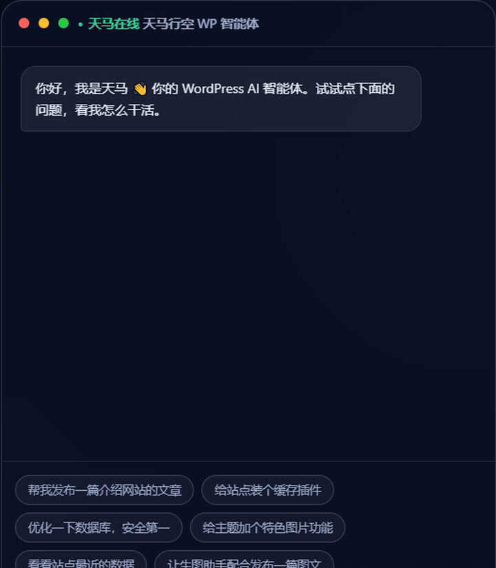

<div align="center">

# 波克wpAI自动化插件

**让 WordPress 自己干活** —— 内置在 WordPress 后台的 AI 智能体（AI Agent）插件

用中文聊天的方式，完成全站管理、内容创作、网页采集、代码开发与系统维护

[](https://github.com/zhikanyeye/wp-auto-Master/releases)
[](LICENSE)
[](https://wordpress.org/)
[](https://www.php.net/)
[](#工具清单)

[项目主页](https://github.com/zhikanyeye/wp-auto-Master) ·
[下载最新版](https://github.com/zhikanyeye/wp-auto-Master/releases) ·
[问题反馈](https://github.com/zhikanyeye/wp-auto-Master/issues)

</div>

---

## 效果演示



> 用自然语言让智能体发布文章、采集内容、安装插件、优化数据库、创建定时任务。

---

## 它是什么

一套可扩展的 WordPress AI 智能体引擎。你把想做的事用中文说出来，它自己拆解步骤、调用工具、执行、汇报结果，危险操作前还会先问你一句。

```
你：帮我发布一篇介绍网站的文章
插件：文章已创建（ID 123）→ 已归入「新闻」分类 → 已发布

你：把某站科技频道最近 5 篇文章采过来，存草稿
插件：已探测页面结构 → 列表命中 12 条 → 采集 5 篇 → 图片本地化 18 张 → 均存草稿

你：优化一下数据库，安全第一
插件：数据库已备份 → 缓存已清理
```

---

## 核心能力

| 能力 | 说明 |
| :--- | :--- |
| **83 项专业工具** | 内容、文件代码、主题插件、系统维护、网页采集、多角色协作全覆盖 |
| **网页采集** | 探测页面结构、生成选择器规则、清洗正文、图片本地化、来源去重、定时批量采集 |
| **自主规划** | 复杂任务自动拆解为步骤，逐步执行并实时反馈 |
| **自学习记忆** | 内置向量记忆库（情景 / 语义 / 程序三类记忆），任务经验自动沉淀 |
| **独立嵌入服务** | 记忆向量固定使用 `BAAI/bge-m3`，可单独配置硅基流动 API Key，不影响主模型 |
| **多模型支持** | DeepSeek / 智谱 / 通义千问 / 腾讯混元等 9+ 家，兼容 OpenAI 协议 |
| **高危确认 + 审计** | 删除、覆盖、改库等操作执行前确认，全程留痕可追溯 |
| **定时任务** | 「每天备份数据库」「每周一发文」到点自动执行，无需在线 |
| **多角色协作** | 创建能力角色（内容 / 生图 / 运维…），多角色分工完成复杂任务 |
| **工作日志** | 关键进展按天记录，跨对话不丢失，AI 可读可写 |
| **后台异步执行** | AI 回复走独立进程，不阻塞 Web 工作进程，长任务不卡站 |

---

## 适用场景

| 站点类型 | 你说的话 | 它做的事 |
| :--- | :--- | :--- |
| 个人博客 | 把今天这篇随笔排好版发布 | 自动分类、配图、发布 |
| 资讯聚合站 | 采集这个频道的文章，每天一次 | 生成采集规则 + 定时任务，自动入库存草稿 |
| 电商站 | 上架 3 款新品，价格按进价 1.5 倍 | 自动建商品页、写描述、设价格 |
| 企业官网 | 每周一生成上周运营数据简报 | 定时任务，到点自动出报告 |
| 多语言站 | 这篇文章翻译成英文和日文各发一版 | 自动翻译、生成多语言页面 |
| 开发 / 设计 | 给主题加个深色模式开关 | 读写主题代码，改动前自动备份 |
| 内容团队 | 让生图助手配合写一篇图文推文 | 多角色协作，生图 + 发文一条龙 |

---

## 网页采集

面向资讯站与内容聚合站的完整采集链路，全部通过对话完成，无需手写规则文件。

**推荐工作流**

```
1. 探测结构      让 AI 分析目标页面，给出候选选择器
2. 验证列表      确认列表选择器能正确取到文章链接
3. 验证字段      确认标题 / 正文 / 时间选择器无误（不入库）
4. 单篇试跑      采一篇看效果
5. 固化规则      规则存库，可反复执行
6. 批量执行      一轮采集多篇，支持分页
7. 定时采集      配合定时任务持续更新
```

**采集特性**

- 内置 CSS 选择器引擎：支持 `.class`、`#id`、`[attr^="value"]`、后代与子级组合、逗号分组、`:first` / `:eq(n)` 等位置伪类
- 相对链接自动补全：协议相对、根相对、同级、`./`、多级 `../` 全支持，自动丢弃锚点与伪链接
- 正文清洗：删除脚本 / 样式 / iframe / 广告等噪音节点，支持关键词批量替换
- 图片本地化：远程图片转存媒体库，首图可自动设为特色图片，修复懒加载 `data-src`
- 内容去重：按来源地址自动跳过已采集文章
- 编码兼容：自动识别并转换 GBK / GB2312 等非 UTF-8 页面
- 登录态采集：支持传入 Cookie 采集需登录可见的页面

> **合规提醒**：请仅采集你拥有版权或已获授权转载的内容，并遵守目标站点的 robots 协议与服务条款。采集功能默认存草稿，便于人工复核后再发布。

### 采集自动化

首次使用时，在对话中描述目标网站和采集要求。Agent 会依次探测页面结构、验证列表链接、验证标题和正文字段、试采一篇，再保存采集规则。规则保存后可以通过 `collect_run_rule` 重复执行，也可以在「波克wpAI → 定时任务」中创建周期任务。

固定网站建议使用规则和定时任务，临时页面适合直接通过对话采集。采集默认创建草稿，确认内容和版权后再发布。

### 记忆向量化配置

记忆向量模型固定为 `BAAI/bge-m3`，默认接口地址为硅基流动的 OpenAI 兼容地址。进入「波克wpAI → 模型设置 → 记忆向量化」，单独填写硅基流动 API Key，并使用「测试嵌入服务」验证连接。该 Key 与主模型 API Key 独立保存；留空时自动使用中文关键词检索，插件其他功能继续可用。

---

## 安装

1. 从 [Releases](https://github.com/zhikanyeye/wp-auto-Master/releases) 下载插件 zip
2. WordPress 后台 → **插件 → 安装插件 → 上传插件**，选择 zip 安装并启用
3. 进入 **波克wpAI → 模型设置**，填入大模型 API Key
4. 回到 **波克wpAI → 对话**，直接开聊

### 从源码打包

仓库提供白名单打包脚本，只将插件运行所需的 `includes`、`admin`、`assets`、入口文件、卸载文件、`readme.txt` 和 `LICENSE` 放入 zip。项目根目录的 `README.md`、`.github`、测试脚本、`.monkeycode` 和其他开发文件不会进入分发包。

```bash
bash scripts/package-plugin.sh
```

脚本会从 `bokeauto.php` 读取插件版本，默认生成 `boke-wpai-automation-v2.1.2.zip` 这类带版本号的文件。推送 `v*` 标签后，GitHub Actions 会自动生成带插件名和版本号的构建标题，附加构建摘要，并根据提交记录生成分类 Release Notes，再将同名 zip 附加到 GitHub Release。手动运行工作流时会生成同样的带版本号 zip 和构建摘要，并上传 Artifact。

**环境要求**

| 项目 | 要求 |
| :--- | :--- |
| WordPress | 6.0 及以上 |
| PHP | 7.4 及以上 |
| PHP 扩展 | `dom`、`mbstring`（采集功能需要） |
| 可选 | PHP CLI 可用且未禁用 `exec` / `proc_open`（用于后台异步执行；不可用时自动降级为同步） |
| 可选 | `wp-content/uploads` 可写（异步流文件与图片本地化需要） |

---

## 工具清单

共 **83** 项工具，按需分组加载，避免一次性塞满模型上下文。

| 工具组 | 覆盖范围 |
| :--- | :--- |
| **核心** | 站点信息、文章/页面/媒体/分类查询、记忆检索、工作日志、网页读取 |
| **内容** | 文章与页面增删改查、媒体上传、分类标签管理、AI 生图 |
| **文件代码** | 目录列表、读取、写入（自动备份）、删除、重命名、建目录、PHP 语法检查 |
| **主题插件** | 插件启用/停用/删除/安装、主题列表/切换/删除、插件与主题骨架生成 |
| **系统维护** | 站点设置读写、用户管理、数据库备份、缓存清理、更新检查、日志查看、只读 SQL |
| **网页采集** | 结构探测、链接提取、字段验证、采集入库、图片本地化、规则管理、批量执行 |
| **角色协作** | 角色与技能创建管理、单角色调用、多角色协作、定时任务管理 |
| **插件自管理** | 记忆库查看清理、审计日志、Token 用量统计、模型切换、自定义工具管理 |

---

## 安全设计

- **高危操作确认**：删除文件、覆盖代码、改写数据库等操作执行前请求用户确认
- **全程审计**：所有工具调用留痕，可追溯执行者、参数与结果
- **写入前备份**：修改主题 / 插件代码文件前自动备份原文件
- **路径校验**：文件操作限制在 WordPress 目录内，拒绝越界路径
- **SQL 只读**：内置 SQL 查询工具仅允许只读语句
- **采集地址校验**：采集与图片下载前校验目标地址，拒绝内网与非法协议

---

## 开源协议

本插件以 **[GPL-2.0-or-later](LICENSE)** 协议发布，完全免费开源。

### 致谢与协议说明

本项目的诞生离不开以下开源项目，在此致谢：

| 项目 | 协议 | 本项目中的关系 |
| :--- | :--- | :--- |
| [tianma-chat](https://github.com/wpomniagentAI/tianma-chat) | GPL-2.0 | 本插件的上游项目，AI 智能体核心框架在其基础上改进与扩展 |
| [FatRat-Collect（胖鼠采集）](https://github.com/KitePig/FatRat-Collect) | GPL-3.0 | 网页采集功能的设计思路参考来源，**代码为独立实现，未复制其源码** |

关于协议的说明：

- 上游项目 tianma-chat 采用 GPL-2.0，本项目作为其衍生作品，同样以 GPL-2.0-or-later 发布，符合 GPL 传染性要求。
- FatRat-Collect 采用 GPL-3.0。本项目的采集模块（`includes/class-collector.php`、`includes/class-tools-collect.php`）为从零编写的独立实现，仅在功能设计层面借鉴其思路，未引入任何 GPL-3.0 代码，因此不触发 GPL-3.0 的许可传染。
- 如果你在本项目基础上二次开发，请同样遵守 GPL-2.0-or-later，保留版权与协议声明。

---

## 关于

- **作者**：zhikanyeye
- **项目主页**：https://github.com/zhikanyeye/wp-auto-Master
- **问题反馈与功能建议**：[提交 Issue](https://github.com/zhikanyeye/wp-auto-Master/issues)

如果这个插件帮到了你，欢迎去项目主页点个 Star，这是对开源最直接的支持。

---

<div align="center">

**波克wpAI自动化插件** · 由 zhikanyeye 开发维护 · GPL-2.0-or-later

</div>
